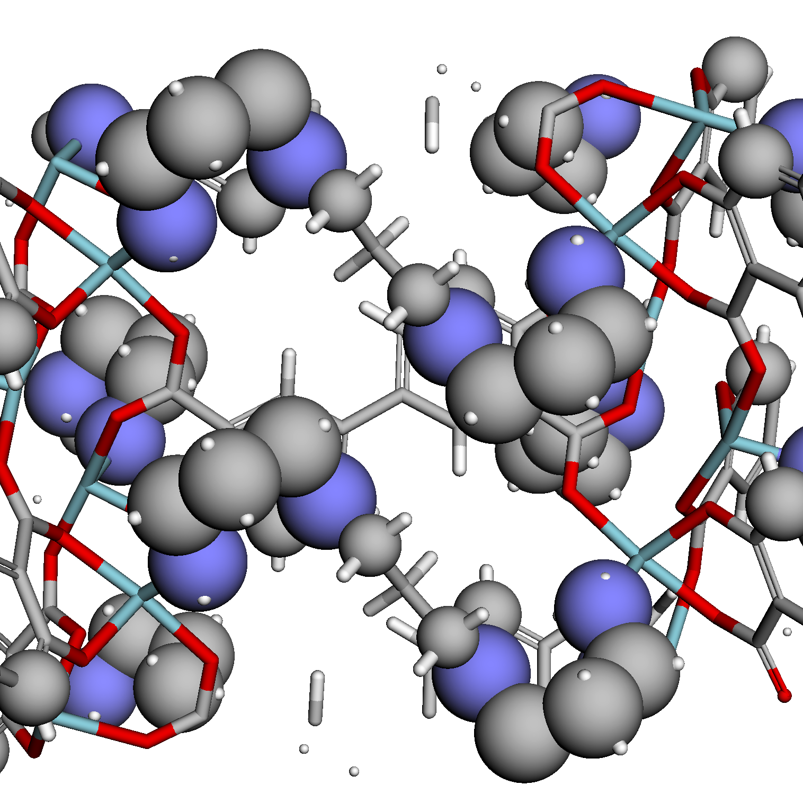

# SpbNet

SpbNet is the official implementation of the paper.

To finetune spbnet, we recommend to make a new directory.

```sh
mkdir test
cd test
```

## Install

### Depedencies

All the code is tested on Linux. We recommend using Linux to reproduce or use SpbNet.

SpbNet depends on

```python
python>=3.8
```

### Installation

SpbNet is uploaded to [Pypi](https://pypi.org). Simply use

```shell
pip install spbnet
```

### Download weight

The weight has been uploaded in [Figshare](https://figshare.com).

Save the weight to your directory, such as `./ckpt/spbnet.180k.ckpt`

Your directory should look like:

```txt
- test
    - ckpt
        spbnet.180k.ckpt
```

## Data Preprocessing

SpbNet need to preprocess the `cif` format files to obtain structure and potential energy embedding.

### Install GRIDAY

The code to generate energy grid depend on `make` and `g++`. Use the following command to install.

```shell
spbnet install-make
spbnet make-griday
```

The first command will install `make` and C++ compiler tools via conda.
The second command will compile the code to generate energy grid.

### Build Data

SpbNet has provided the command to preprocess data.

To use SpbNet, please provide your dataset first. Your dataset should look like

```txt
- test
    - ckpt
        spbnet.180k.ckpt
    - data
        - cif
            mof1.cif
            mof2.cif
            ...
        benchmark.csv
```

The `benchmark.csv` contains the label data, which should look like

```txt
cifid,CO2
mof1,1.29
mof2,3.81
...
```

The `cifid` colume is needed, while other colums represent the tasks needed to be predicted.

Then use the following command to build data:

```sh
spbnet build-data --root-dir ./data
```

SpbNet will produce the following files:

```txt
- test
    - ckpt
        spbnet.180k.ckpt
    - data
        - cif
            - mof1.cif
            - mof2.cif
            ...
        - spbnet
            - graphdata
                - mof1.graphdata
                - mof2.graphdata
                ...
            - grid
                - mof1.grid
                - mof2.grid
                ...
            - griddata8
                - mof1.npy
                - mof2.npy
                ...
        benchmark.csv
```

### Split Labels

You can split the label data to test the SpbNet's performance. We have provide a command to do this.

```sh
spbnet filter-data --root-dir ./data
```

This command will look up the `benchmark.csv` to check if all the cif files are correctly preprocessed.
In addtion, `filter-data` will filter all the outlier point according to `Q1 - outlier * IQR` and `Q3 + outlier * IQR`.
By default, `outlier` is set to `5`. You can use `spbnet filter-data --root-dir PATH/TO/YOUR/ROOT_DIR --outlier -1` to cancel this behavior.

If correctly preprocessed, the directory should look like

```txt
- test
    - ckpt
        spbnet.180k.ckpt
    - data
        - cif
            xxx.cif
        - spbnet
            - graphdata
                xxx.graphdata
            - grid
                xxx.grid
            - griddata8
                xxx.npy
        benchmark.csv
        benchmark.filter.csv
        benchmark.train.csv
        benchmark.validate.csv
        benchmark.test.csv
```

You can check if the data is correctly preprocessed by

```sh
spbnet check-data --root-dir ./data
```

This command will automatically check the `benchmark.train.csv`, `benchmark.validate.csv` and `benchmark.test.csv`.

## Finetune

After data preprocessing, you can finetune SpbNet.

To configure spbnet, provide a configuration file, such as `config.example.yaml`. The file should look like

```yaml
ckpt: './ckpt/spbnet.18w.ckpt'
data_dir: './data'
id_prop: './data/benchmark.csv'
task: 'CO2-298-2.5'
log_dir: './logs/hmof'
```

- ckpt: pPath to the checkpoint to finetune
- data_dir: The root directory of data
- id_prop: The label data. If it is set to `benchmark.csv`, spbnet will automatically find `benchmark.train.csv`, `benchmark.validate.csv` and `benchmark.test.csv`
- task: The task to train. Should be one of the colums in the `benchmark.csv`
- log_dir: The logger directory. Used by `pytorch-lightning`

NOTE: More configuration can be found in github repository. An important configuration is `max_graph_len`, which is max length of tokens, since SpbNet is based on Transformer architecture. To choose `max_graph_len`, you can estimate the average atom number using this command first.

```sh
spbnet calc-atomnum --root-dir ./data/cif
```

We recommend to choose the number most close to the average number of atoms of your dataset from `512`, `768`, `1024`. For `hMOF` and `CoREMOF` dataset, we recommend `512` (default). For tobacco dataset, we recommend to use `1024`.

Thus, your directory should look like:

```txt
- test
    - ckpt
        spbnet.180k.ckpt
    - data
        - cif
            xxx.cif
        - spbnet
            - graphdata
                xxx.graphdata
            - grid
                xxx.grid
            - griddata8
                xxx.npy
        benchmark.csv
        benchmark.filter.csv
        benchmark.train.csv
        benchmark.validate.csv
        benchmark.test.csv
    config.example.yaml
    main.py
```

The `main.py` should contain the code to finetune spbnet, which should like:

```python
import spbnet

spbnet.finetune("./config.example.yaml")
```

After finetuning, the result (checkpoint and test result) should be saved in the directory specified by `log_dir`.
The path may look like: `./logs/hmof/CO2-298-2.5/version_0`.

Your directory should look like:

```txt
- test
    - ckpt
        spbnet.180k.ckpt
    - data
        ...
    - logs
        ...
    config.example.yaml
    main.py
```

## Visualize

SpbNet provide visualization of attention score and atom grid.

To visualize cif file, make a new directory and prepare a `cif` format file. Such as

```txt
- test
    ...
    - vis
        - cif
            mof1.cif
```

Change to the `vis` directory and build modal data:

```sh
cd vis
spbnet build-modal-data --cif-path ./cif/mof1.cif
```

By default, SpbNet will make a `modal` directory under `vis` directory. The directory should look like:

```txt
- test
    ...
    - vis
        - cif
            mof1.cif
        - modal
            - attn
            - energycell
                mof1.cif
            - graphdata
                mof1.graphdata
            - grid
                mof1.grid
            - griddata
                mof1.griddata
            - griddata8
                mof1.griddata8
            - mol
            - supercell
                mof1.cif
            - total
```

Now you can get attention score.

```sh
spbnet attn --cif-dir ./cif/mof1.cif --modal-dir ./modal --ckpt PATH/TO/YOUR/CKPT
```

SpbNet will make an `attn` directory under your current directory, with the `mof1.html` file.

Now open the `mof1.html`. You should see `3dmol` like the following.


